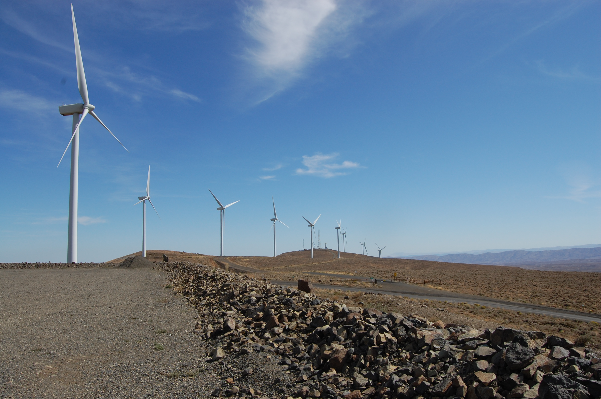

# Project Brainstorm
__________________________________
# Renewable Energy in Washington

>As the world's [non-renewable energy sources are quickly depleting](https://mahb.stanford.edu/library-item/fossil-fuels-run/), we feel that understanding research around renewable energy sources will be vital in the future, especially when nonrenewable sources such as petroleum are fully exhausted. Moreover, research and think tanks claim that renewable energy not only makes people happier, but also richer [[1]](https://www.climatechangenews.com/2016/01/16/renewables-happier-richer-world/). With this project we want to see if Washington State has been effective in achieving its’ goal to capture more renewable energy [[2]](https://www.governor.wa.gov/news-media/state-pursues-new-smart-grid-projects-capture-store-more-solar-and-wind-power). Hence, due to the inevitable shift towards renewable energy and its potential for widespread improvement of welfare, we picked the field of energy as our domain of interest.

### Recent Renewable Energy Research of Interest

- *Washington State Renewable Energy: Identifying Optimal Locations*

  The Stanford project identifies optimal locations for renewable energy within Washington state. This project explores solar, wind, and hydro levels around the state and where areas experience more or less of the energy source [[3]](https://sites.google.com/a/stanford.edu/eessgisfall2013/group-projects/group-11-energy).

- *Impacts of renewable energy consumption on the German economic growth*

  Analysis of quarterly renewable energy usage in Germany to examine its relationship with economic growth and capital development. Usage of renewable energy sources is predicted to improve economic growth by 0.22% [[4]](https://www.sciencedirect.com/science/article/pii/S1364032116308541?casa_token=oL4yiBwNttsAAAAA:BbrI9JjG2ZLqbZpv0vxKeisi8G-8n90n_mlYtZsw68W4CIL3xkRvSLPyUZX5bRLf4yq2zhWOAwY).

- *CO2 emissions, economic and population growth, and renewable energy: Empirical evidence across regions*

  Verifying the combined effect population growth has on emissions and economic growth around the world. Specific continents can have a more significant shift in CO2 levels given how much a country's energy production consists of renewable energy [[5]](https://www.sciencedirect.com/science/article/pii/S0140988318303256?casa_token=EFt-HScpoFUAAAAA:-s9bm6X2PeT2kKjoDdFMDZ9kF7iTfSahwrsdIVatg0eE1iTya78tP87vvgso-PcQ_8hUlceiB0A).

### Questions to Consider + Path of Action
> *Is using renewable energy expensive or cheaper than using non-renewable energy at this moment in the state of Washington? (essentially, seeing if renewable energy is cheap at a micro level).*

We can see if renewable sources are cheaper at micro level by viewing the Energy prices in Washington State (by energy source) (see Source 1, sheet YT04).

> *How expensive is renewable energy at a sector level? Is it more expensive than non-renewable energy?*

Determine if renewable sources are cheaper at sector level by viewing Energy price and expenditures by sector (by sector) (see Source 1, Sheet YT06 and Sheet YT03).

> *How dependent is Washington state on non-renewable sources when compared to previous years?*

We can see how dependent Washington is on non-renewable sources by viewing the Energy supply by fuel source (YT08), PRIMARY ENERGY CONSUMPTION BY ENERGY SOURCE1 (YT02)

> *Are we on course to achieving renewable energy goals in Washington state?*

We can use renewable energy consumption as a share of state total to understand how dependent each state of US is on renewable energy

> *What percentage of energy is attributed to renewable practices?*

View total energy usage per type in Sources 1 and 3. Compare proportions if necessary.

> *How dependent is each state on renewable energy?*

View total energy usage per type in Sources 1 and 3. Compare proportions if necessary.

### Potential Data Sources

1. [**Washington State Data Book: *Energy***](https://www.ofm.wa.gov/washington-data-research/statewide-data/washington-state-data-book)

The data gives information regarding the cost of energy (by sector and by energy source in Washington State. Moreover, it also gives information regarding the consumption of energy in the state.

It is compiled by the Washington State Energy Office. This office advises policy making and other practices to advance the implementation of clean energy in Washington state.  

 + Questions it can answer:
  + It intends to answer if renewable sources are cheaper at micro and sector level. Additionally, it answers how dependent is Washington state on non-renewable sources when compared to previous years.

 + Data information
  + Number of rows: 31 (Sheet YT01)
  + Number of columns: 6 (Sheet YT01)

 + Source: See "Energy" in *data*

2. [**Washington Primary Energy Consumption Estimates, 2018**](https://www.eia.gov/state/seds/data.php?incfile=/state/seds/sep_sum/html/sum_btu_totcb.html&sid=US&sid=WA)

The data informs the average price of electricity to end customers by state. Specifically, it notes the amount of energy that each state nets (amount of information given the type of source.

This information was collected by the US Energy Information Administration (EIA). The EIA informs the public and policy makers about the state of current energy practices in the United States.

 + Questions it can answer:
  + It answers and gives additional information regarding how dependent Washington is on non-renewable sources.

 + Data information
  + Number of rows: 52
  + Number of columns: 28

 + Source: See "Primary Energy Consumption Estimates, 2018" in *data*

3. [**Emissions & Generation Resource Integrated Database, 2018**](https://www.eia.gov/state/seds/data.php?incfile=/state/seds/sep_sum/html/sum_btu_totcb.html&sid=US&sid=WA)

Data includes greenhouse gas emissions and energy production levels in different sectors. Scales of data range from an individual corporation to the entire nation.

The US Protection Agency collected the data. It is an executive agency concerned with environmental protection matters.

+ Questions it can answer:

 + It answers the questions whether renewable sources are cheaper at sector level, and gives information regarding how dependent Washington state, and other states are on renewable energy.

+ Data information
 + Number of rows: 26732 (Sheet UNT18)
 + Number of columns: 32 (Sheet UNT18)

+ Source: See "egrid2018_data_v2" in *data*
